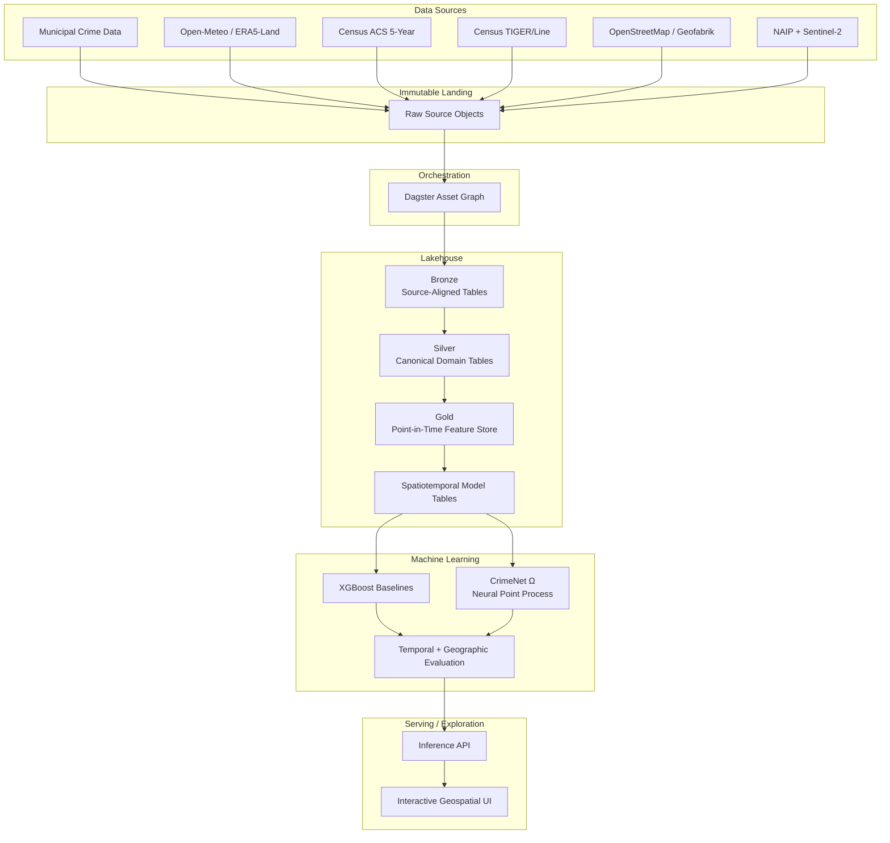

# CrimeNet

[](https://github.com/arcode35/crimenet/actions/workflows/ci.yml)


**CrimeNet is a large-scale geospatial data and machine learning platform for modeling crime intensity across space and time.**

It transforms heterogeneous municipal crime records into a standardized, leakage-aware spatiotemporal feature store enriched with weather, solar conditions, socioeconomic data, road-network context, Census geography, and satellite/aerial imagery.

The current audited core contains **13.56 million raw crime records across eight major U.S. cities**, producing **13.29 million standardized offenses** and approximately **79.8 million model-table rows** across the current train, validation, and test splits.

CrimeNet is designed as both a data-engineering system and an ML research platform: reproducible ingestion, point-in-time-correct feature generation, large-scale geospatial joins, model training, evaluation, and eventually low-latency inference all share the same underlying data contracts.

---

## At a Glance

| Metric                                |            Current scale |
| ------------------------------------- | -----------------------: |
| Audited core cities                   |                    **8** |
| Raw municipal crime records           |           **13,557,419** |
| Standardized Silver offenses          |           **13,294,283** |
| Canonical crime subtypes              |                   **87** |
| Train model rows                      |           **63,207,176** |
| Validation model rows                 |            **8,232,842** |
| Test model rows                       |            **8,325,680** |
| Total current model rows              |        **~79.8 million** |
| Large model-table scans               | **2.3–2.6 billion rows** |
| Model-table Parquet footprint         |              **~200 GB** |
| Imagery H3-r9 cells in core footprint |               **38,560** |
| Evaluation horizon                    |     **2014 – July 2026** |

### Core geographic coverage

- Baltimore
- Chicago
- Dallas
- Fort Worth
- New York City
- San Francisco
- Seattle
- Washington, DC

Additional municipal sources are being onboarded through the same source-contract architecture.

---

## System Architecture



CrimeNet follows a medallion-style architecture, but the project is no longer coupled to a single managed compute platform.

The current `main` branch is built around a portable Python data stack using **Dagster, Polars, Delta Lake/delta-rs, object storage, PyTorch, and XGBoost**.

The previous Databricks-oriented implementation is preserved separately on the `databricks` branch.

---

# Data Platform

## 1. Immutable Landing

Municipal datasets and external source artifacts are preserved before transformation.

The landing layer supports:

- Deterministic replay
- Source-level auditing
- Recovery from failed transformations
- Schema debugging
- Historical backfills
- Reprocessing without redownloading upstream data

Raw source files are stored in object storage rather than committed to Git.

---

## 2. Bronze: Source-Aligned Tables

Each municipal dataset enters a source-specific Bronze table.

Bronze preserves the semantics of the original publisher rather than immediately forcing every city into one schema.

Typical metadata includes:

- Source city
- Source object URI
- Ingestion run ID
- Ingestion timestamp
- Original source identifiers
- Derived occurrence year
- Raw source fields

CrimeNet supports heterogeneous input formats including:

- CSV
- Parquet
- GeoJSON
- Multi-file datasets
- Ragged or malformed CSV exports
- Source-specific historical layouts

Source-specific parsing remains isolated at the ingestion boundary.

---

## 3. Silver: Canonical Crime Model

Bronze datasets are standardized into a shared crime schema.

The current core Silver dataset contains:

**13,294,283 standardized crime offenses.**

Normalization resolves differences in:

- Incident identifiers
- Offense identifiers
- Timestamp formats
- Latitude and longitude fields
- Address formats
- Crime descriptions
- Crime codes
- Null encodings
- Historical schema changes
- Duplicate records

Crime offenses are mapped into a canonical hierarchy containing **87 crime subtypes**.

Canonical mapping coverage is approximately **95%–100% across the audited core cities**, depending on the source.

This allows downstream feature engineering and modeling to remain independent of city-specific source schemas.

---

# Point-in-Time Feature Engineering

CrimeNet treats leakage prevention as a data-engineering constraint rather than something applied only during model training.

Features are attached according to what would actually have been available at the prediction timestamp.

The feature system tracks concepts such as:

```text
feature_available_at
feature_version_id

osm_snapshot_date
osm_available_at

acs_vintage
acs_release_date

tiger_line_year
tiger_release_date
```

This makes it possible to reconstruct historical feature states without silently incorporating future information.

---

## Weather

Historical environmental conditions are derived from Open-Meteo / ERA5-Land.

Features include variables such as:

- Temperature
- Precipitation
- Wind
- Cloud cover
- Atmospheric conditions

Weather queries are spatially deduplicated using H3 cells and temporally aligned to event timestamps.

Instead of issuing redundant requests for every crime coordinate, CrimeNet reuses environmental observations across spatially equivalent cells.

---

## Solar and Lighting Conditions

CrimeNet uses `pvlib` to calculate physical solar conditions for historical location-time pairs.

Derived features include:

- Solar elevation
- Apparent solar elevation
- Solar zenith
- Solar azimuth
- Daylight state
- Lighting category

This produces a physically meaningful representation of environmental lighting rather than relying only on clock time.

---

## Census Socioeconomic Data

CrimeNet integrates ACS 5-year tract-level estimates including:

- Population
- Median age
- Median household income
- Poverty rate
- Unemployment rate
- Vacancy rate
- Renter occupancy
- Household vehicle availability
- Additional demographic and housing variables

### Leakage-safe ACS selection

Historical observations are never assigned a Census vintage simply because it is the newest available dataset today.

Eligibility is based on the actual ACS release date.

Conceptually:

```text
feature_available_at > acs_release_date
```

A historical training observation can therefore use only socioeconomic data that had already been released at that point in time.

---

## Census Geography

Crime coordinates are mapped to Census tracts using the appropriate TIGER/Line boundary vintage.

Spatial mappings are versioned by geography release so historical observations can be associated with the correct tract system.

This prevents geographic revisions from silently changing historical feature assignments.

---

## OpenStreetMap

CrimeNet builds spatial context from historical OpenStreetMap extracts.

Features characterize the surrounding built environment, including signals such as:

- Road-length density
- Major-road ratio
- Residential-road ratio
- Local network composition
- Other H3-aggregated infrastructure features

OSM snapshots are versioned so historical observations can use a snapshot consistent with feature availability.

---

# Multi-Resolution H3 Architecture

CrimeNet uses H3 as the common spatial index between otherwise heterogeneous feature domains.

Different resolutions are used for different feature semantics rather than forcing every dataset onto one grid.

Examples include:

| Domain                                    | Spatial representation           |
| ----------------------------------------- | -------------------------------- |
| Crime aggregation / environmental context | H3                               |
| OSM context                               | Higher-resolution H3 aggregation |
| Census socioeconomic data                 | Census tract + H3 linkage        |
| Aerial / satellite imagery                | **H3 resolution 9**              |
| National temporal feature store           | **H3 resolution 9**              |

H3 provides:

- Stable spatial keys
- Efficient spatial aggregation
- Reusable feature lookups
- Reduced API request volume
- Consistent cell-time model targets
- A path from city-scale modeling to national inference

---

# Imagery Feature Pipeline

CrimeNet includes a geospatial imagery pipeline using:

### NAIP

High-resolution U.S. aerial imagery provides local built-environment information.

### Sentinel-2 L2A

Multispectral satellite imagery adds broader temporal and environmental context.

For the original eight-city footprint, the imagery system covers:

**38,560 H3 resolution-9 cells.**

Current processing includes:

```text
Imagery discovery
      ↓
Spatial deduplication
      ↓
Scene selection
      ↓
Image retrieval
      ↓
Preprocessing
      ↓
Foundation-model embeddings
      ↓
Versioned feature storage
```

Embeddings are stored as reusable features rather than repeatedly performing image inference during every downstream model-training run.

This keeps large-scale experimentation practical while preserving the ability to recompute representations when the imagery encoder changes.

---

# National Temporal Feature Store

The city-scale pipeline is being generalized into a national H3 feature store.

Each feature version records both its value and when that value became available.

A feature-store record may include:

```text
H3 cell
feature_available_at
feature_version_id

OSM snapshot
ACS vintage
ACS release date
TIGER release
socioeconomic context
road-network features
```

This enables queries of the form:

> What did CrimeNet legitimately know about this location on this date?

That point-in-time contract is essential for both historical evaluation and future production inference.

---

# Model Table

The Gold feature layer is transformed into spatiotemporal model tables containing observed event windows and sampled non-event windows.

The current K=5 configuration contains approximately:

```text
Train       63,207,176 rows
Validation   8,232,842 rows
Test         8,325,680 rows
────────────────────────
Total       79,765,698 rows
```

Current chronological evaluation:

```text
Train       2014–2023
Validation  2024
Test        2025–2026-07-24
```

Large feature-assembly jobs have scanned approximately **2.3–2.6 billion intermediate rows**, with the resulting model-table Parquet dataset on the order of **200 GB**.

The system is intentionally built to operate beyond single-DataFrame, single-machine assumptions even when individual stages can be executed locally.

---

# Machine Learning

CrimeNet supports multiple modeling families over the same leakage-safe feature system.

## XGBoost Baselines

The original planned XGBoost baseline is now implemented.

CrimeNet uses gradient-boosted models for:

- Crime occurrence modeling
- Intensity estimation
- Feature importance analysis
- Calibration experiments
- Geographic validation
- Strong non-neural baselines

Hyperparameter search is managed with Optuna, and large experiments can be distributed across cloud compute.

The intensity model has been trained at full project scale with thousands of boosting iterations and multi-city validation.

---

## CrimeNet Ω

**CrimeNet Omega** is the neural research model built on top of the same feature infrastructure.

The current architecture is based on marked temporal point-process modeling and incorporates:

- City embeddings
- Crime-subtype embeddings
- Lighting-state embeddings
- Continuous numerical covariates
- Event exposure
- Marked event likelihoods
- Temporal intensity modeling

The broader research direction includes:

- Covariate-conditioned neural Hawkes processes
- Hierarchical crime taxonomy modeling
- Continuous-time spatial context
- Graph-based neighborhood interaction
- Explicit observation/reporting models
- Better treatment of spatial and temporal dependence

Omega is a research system and is evaluated against the simpler tree-based baselines rather than assumed to be superior.

---

# Large-Scale Compute

CrimeNet workloads span several compute profiles:

### CPU / memory-heavy data engineering

Used for:

- Source normalization
- Large joins
- H3 feature construction
- Historical backfills
- Parquet materialization
- Spatial preprocessing

### GPU workloads

Used for:

- Neural point-process training
- Satellite/aerial image embeddings
- Large hyperparameter searches
- Deep feature extraction

Large experiments have been executed on multi-GPU cloud machines, including **8× RTX 5090-class GPU configurations** with hundreds of gigabytes of host memory.

The compute layer is intentionally portable: storage and data contracts are not tied to the lifetime of any individual training instance.

---

# Storage Architecture

CrimeNet uses Backblaze B2 as a cost-efficient durable object store for large datasets.

The current Delta Lake integration separates transactional metadata operations from bulk analytical reads:

```text
                      Backblaze B2
                           │
             ┌─────────────┴─────────────┐
             │                           │
        Native B2 API               S3-compatible API
             │                           │
      delta-rs / OpenDAL                Polars
             │                           │
      Delta transactions            Parquet scans
             │                           │
             └──────── same data ────────┘
```

### Why the split?

B2's S3-compatible API does not implement every AWS S3 conditional-write primitive required by modern Delta transaction-log commits.

CrimeNet therefore uses:

- `b2://` through **delta-rs + OpenDAL** for Delta transaction operations
- `s3://` through B2's S3-compatible endpoint for high-throughput Polars Parquet reads

Dagster writer pools enforce the project's single-writer-per-table operating contract.

---

# Orchestration

The current data platform is orchestrated with **Dagster**.

Assets are organized around explicit dependencies between:

- Source landing
- Bronze ingestion
- Silver normalization
- External feature generation
- Gold materialization
- Model-table construction
- Model training
- Evaluation

This provides:

- Dependency-aware execution
- Per-table writer isolation
- Materialization metadata
- Structured logging
- Re-runnable assets
- Failure isolation
- Backfill support
- Incremental extension to new cities

City ingestion is generated from declarative source contracts rather than maintaining a separate handwritten pipeline for every municipality.

---

# Data Quality

CrimeNet fails loudly when data contracts are violated.

Controls include:

- Required-field checks
- Timestamp parsing validation
- Coordinate validation
- Source-key deduplication
- Malformed-row handling
- Canonical taxonomy coverage
- Spatial-match validation
- Feature-key uniqueness checks
- Point-in-time feature eligibility
- Join-cardinality checks
- Train/validation/test leakage controls
- Feature-match coverage monitoring

Feature joins are designed to avoid silently dropping crime records.

Historical data is preserved even when an enrichment feature is unavailable.

---

# Reproducibility

CrimeNet is designed so that a model result can be traced back through:

```text
model artifact
    ↓
model-table version
    ↓
feature versions
    ↓
Gold/Silver records
    ↓
Bronze source data
    ↓
original landing object
```

Version metadata is attached throughout the feature system so changes in:

- Source data
- Census vintages
- OSM snapshots
- TIGER releases
- Imagery encoders
- Feature definitions
- Model configurations

can be distinguished from one another.

---

# Technology Stack

## Data engineering

- Python
- Dagster
- Polars
- PyArrow
- Delta Lake
- delta-rs
- OpenDAL
- Backblaze B2
- H3
- DuckDB
- Structured logging

## Geospatial and external data

- OpenStreetMap / Geofabrik
- Open-Meteo / ERA5-Land
- U.S. Census ACS
- Census TIGER/Line
- `pvlib`
- NAIP
- Sentinel-2 L2A

## Machine learning

- PyTorch
- XGBoost
- Optuna
- MLflow
- GPU-accelerated training
- Temporal validation
- Geographic validation

## Engineering

- `uv`
- `pytest`
- GitHub Actions
- Python packaging
- Object-storage-backed datasets
- Configuration-driven pipelines

---

# Repository Layout

```text
crimenet/
├── src/
│   ├── crimenet_data/
│   │   ├── assets/              # Dagster data assets
│   │   │   └── crime/           # Municipal crime ingestion + transforms
│   │   ├── resources/           # Storage and external-system resources
│   │   ├── observability/       # Logging and operational context
│   │   └── definitions.py       # Dagster definitions
│   │
│   └── machine_learning/        # Training and evaluation systems
│
├── tests/                        # Unit and integration tests
├── docs/                         # Architecture and project documentation
└── pyproject.toml
```

Large datasets, downloaded source files, model artifacts, and experiment outputs are intentionally excluded from Git.

---

# Local Development

## Install

```bash
uv sync
```

## Backblaze B2 configuration

CrimeNet expects credentials through environment variables.

```bash
export B2_KEY_ID="..."
export B2_APPLICATION_KEY="..."
export B2_BUCKET_ID="..."

export B2_REGION="us-east-005"
export B2_ENDPOINT_URL="https://s3.us-east-005.backblazeb2.com"
```

Do not commit credentials to the repository.

## Start Dagster

```bash
uv run dagster dev -m crimenet_data.definitions
```

## Run tests

```bash
uv run pytest
```

---

# Design Principles

### Preserve raw data

Source data remains replayable and auditable.

### Isolate source-specific complexity

Municipal schema differences stop at the normalization boundary.

### Treat time as part of the feature contract

A feature is not valid merely because its value is historically associated with an event. It must also have been available at that time.

### Compute expensive features once

Weather queries, solar calculations, spatial mappings, OSM aggregates, and imagery embeddings are materialized for reuse.

### Prefer stable spatial keys

H3 provides a shared indexing system across otherwise incompatible feature domains.

### Fail on ambiguous joins

Duplicate feature keys or unexpected cardinality changes are pipeline failures, not warnings to ignore.

### Separate storage from compute

Training machines are disposable. Durable data and feature versions are not.

### Benchmark complex models against simple ones

Neural architectures must outperform strong tree-based and historical baselines to justify their complexity.

---

# Responsible Use

CrimeNet models **observed crime and reporting patterns across geographic areas and time windows**.

It does not model an individual's propensity to commit a crime.

The system is not designed to:

- Identify likely offenders
- Predict person-level criminal behavior
- Support person-level surveillance
- Make automated policing decisions
- Determine guilt, dangerousness, or intent
- Replace public-policy or domain-expert review

Crime data is not a direct measurement of an underlying objective quantity called "criminality."

Observed records can reflect:

- Reporting behavior
- Police deployment
- Enforcement intensity
- Data-collection practices
- Municipal policy
- Historical bias
- Differences in source coverage

These effects must be considered when interpreting model outputs.

A technically well-calibrated prediction of recorded crime is not necessarily an unbiased estimate of all crime that occurred.

---

# Current Status

### Completed

- [x] Multi-city raw crime ingestion
- [x] Source-specific Bronze architecture
- [x] Canonical Silver crime model
- [x] 87-subtype crime taxonomy
- [x] Historical weather enrichment
- [x] Solar and lighting enrichment
- [x] ACS socioeconomic features
- [x] TIGER/Line geographic mapping
- [x] OpenStreetMap feature pipeline
- [x] Leakage-safe feature availability logic
- [x] Large Gold/model-table construction
- [x] Chronological train/validation/test splits
- [x] XGBoost baseline training
- [x] Hyperparameter optimization
- [x] Multi-city model validation
- [x] NAIP imagery pipeline
- [x] Sentinel-2 imagery pipeline
- [x] Foundation-model imagery embeddings
- [x] Dagster orchestration
- [x] Portable Delta Lake storage on Backblaze B2
- [x] GitHub Actions CI

### In progress

- [ ] National H3 temporal feature store expansion
- [ ] CrimeNet Omega neural point-process modeling
- [ ] Hierarchical marked-event modeling
- [ ] Explicit reporting / observation model
- [ ] Larger-scale imagery feature integration
- [ ] Additional municipal source onboarding
- [ ] Production inference service
- [ ] Interactive geospatial model explorer

### Planned

- [ ] Streaming source ingestion
- [ ] Kafka / Flink event pipeline
- [ ] Automated model monitoring
- [ ] Drift detection
- [ ] Scheduled retraining
- [ ] Low-latency feature retrieval
- [ ] National-scale inference

---

# Background

CrimeNet grew out of **AcciNet**, an earlier geospatial risk-modeling platform built for traffic-crash prediction.

CrimeNet extends that engineering approach into a substantially larger problem:

- More heterogeneous public data
- Longer historical horizons
- Multiple geographic representations
- Point-in-time feature correctness
- Billions of intermediate rows
- Tens of millions of model observations
- Image-derived spatial context
- Continuous-time event modeling
- A path toward national-scale feature infrastructure

The project is intentionally built as an engineering and research system rather than a one-off modeling notebook.

---

# License

Copyright 2026 Aldrin Roshan.

Licensed under the [Apache License 2.0](LICENSE).
