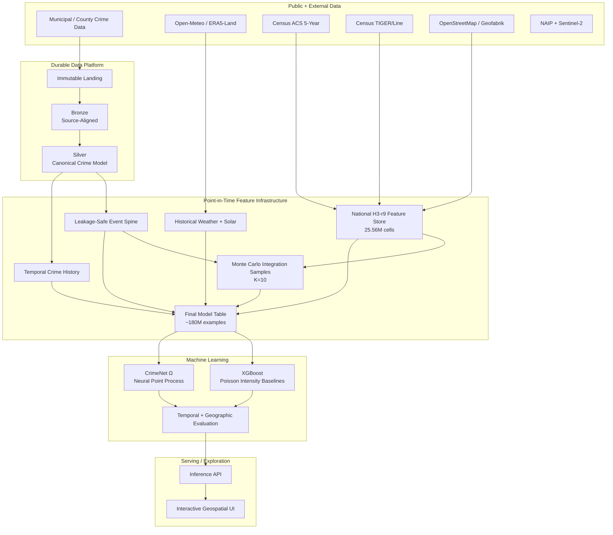

# CrimeNet

[](https://github.com/arcode35/crimenet/actions/workflows/ci.yml)


**CrimeNet is an end-to-end national crime-risk modeling platform built around point-in-time-correct geospatial data, large-scale feature engineering, and continuous-time machine learning.**

The system ingests heterogeneous public-safety records from U.S. municipal and county sources, standardizes them into a shared crime taxonomy, constructs a national H3 feature store from Census socioeconomic and OpenStreetMap built-environment data, generates leakage-safe event and integration examples, and trains models ranging from XGBoost Poisson intensity baselines to a covariate-conditioned neural point process.

The current production data footprint contains **15 Silver-enabled crime sources and 16.7M audited raw source rows**. The national static feature store contains **25.56M unique H3 resolution-9 cells across all 50 states plus Washington, DC**, with **99.83% Census socioeconomic match coverage**. The latest final-model-table pipeline operates at approximately **180M event + integration examples** under the current **K=10** integration-sampling contract.

---

## At a Glance

| Metric                                     |                               Current scale |
| ------------------------------------------ | ------------------------------------------: |
| Registered crime-source adapters           |                                      **19** |
| Silver-enabled production sources          |                                      **15** |
| Audited raw source rows                    |                              **16,700,480** |
| Modeled rows after source-level exclusions |                              **15,955,257** |
| Canonical crime subtypes                   |                                      **87** |
| National H3-r9 feature-store cells         |                              **25,563,443** |
| U.S. state/DC partitions covered           |                                      **51** |
| Census socioeconomic match rate            |                                  **99.83%** |
| Current integration sampling ratio         |                                  **K = 10** |
| Latest final model examples                |                            **~180 million** |
| Train horizon                              |                               **2014–2023** |
| Validation horizon                         |                                    **2024** |
| Test horizon                               | **2025 onward, bounded by source coverage** |
| Large feature-assembly scans               |           **billions of intermediate rows** |

### Current Silver-enabled geographic sources

- Atlanta
- Baltimore
- Chandler, AZ
- Chicago
- Dallas
- Denver
- Fort Worth
- Los Angeles County Sheriff
- Marin County Sheriff, CA
- Montgomery County, MD
- New York City
- San Francisco
- Seattle
- Sonoma County Sheriff, CA
- Washington, DC

Additional registered adapters include Baton Rouge, Boston, East Baton Rouge Parish Sheriff, and Gainesville.

---

## System Architecture



CrimeNet's current `main` branch is built around a portable Python data stack using **Dagster, Polars, Delta Lake/delta-rs, Backblaze B2 object storage, PyTorch, XGBoost, and H3**. The earlier Databricks-oriented implementation is preserved on the `databricks` branch.

---

# Data Platform

## Immutable Landing

Raw municipal files and external source artifacts are preserved before transformation to support:

- deterministic replay
- source-level auditing
- historical backfills
- schema debugging
- recovery from failed transformations
- reprocessing without redownloading upstream data

Large source files and generated datasets live in object storage rather than Git.

## Bronze: Source-Aligned Ingestion

Each source enters through an explicit source adapter. Source-specific parsing remains isolated at the ingestion boundary so municipal schema differences do not leak into downstream modeling code.

CrimeNet currently defines **19 registered source adapters**, of which **15 are Silver-enabled in the audited production pipeline**.

Supported source formats include CSV, Parquet, GeoJSON, multi-file exports, malformed/ragged CSVs, and historical schema variants.

## Silver: Canonical Crime Model

Silver standardizes heterogeneous source data into a shared offense representation.

The current audited 15-source footprint contains:

- **16,700,480 raw source rows**
- **15,955,257 modeled rows after source-level exclusions**
- **87 canonical crime subtypes**

Normalization handles differences in identifiers, timestamps, coordinates, addresses, offense descriptions/codes, null encodings, duplicates, and historical source-schema changes.

---

# National Geospatial Feature Store

CrimeNet now has a **completed and audited national H3 resolution-9 static feature store** rather than a city-only feature layer.

The current national snapshot contains:

- **25,563,443 unique H3-r9 cells**
- coverage across **all 50 states plus Washington, DC**
- **25,520,789 cells matched to Census socioeconomic data**
- **99.83% socioeconomic match coverage**
- exact audited schema and part inventory
- a passing structural audit with no hard failures

The feature store provides a shared spatial representation for reusable model covariates.

## Census socioeconomic features

CrimeNet integrates ACS 5-year features including:

- population
- median age
- median household income
- poverty rate
- unemployment rate
- vacancy rate
- renter occupancy
- household vehicle availability

Historical observations use only Census vintages that were actually available at the model timestamp.

## OpenStreetMap built-environment features

Historical OpenStreetMap/Geofabrik data is transformed into H3-aggregated built-environment features including:

- POI density
- nightlife, food, retail, and transit density
- total road-length density
- major-road density
- intersection density
- dead-end density
- building density
- major/residential/service/one-way road ratios
- POI-category entropy
- land-use entropy
- commercial/residential mix

OSM snapshots are versioned so historical model rows can use a spatial state consistent with information availability.

## Census geography

TIGER/Line boundaries connect H3 cells and event coordinates to the correct historical Census geography. Boundary vintages and release timing are treated as part of the feature contract rather than silently using today's geography for historical rows.

---

# Point-in-Time Correctness

Leakage prevention is enforced in the data platform, not left to individual model-training scripts.

CrimeNet tracks concepts such as:

```text
feature_available_at
feature_version_id

osm_snapshot_date
osm_available_at

acs_vintage
acs_release_date

tiger_line_year
tiger_release_date
```

A feature is eligible only if it was available at or before the prediction timestamp.

This enables the system to answer:

> What could CrimeNet legitimately have known about this place at this time?

The same rule is applied to historical feature joins, temporal crime-history features, split assignment, and evaluation.

---

# Environmental Features

## Historical weather

Historical environmental conditions are derived from Open-Meteo / ERA5-Land and spatially deduplicated through H3.

Features include temperature, humidity, precipitation, wind, cloud cover, and related atmospheric context. Missing historical weather coverage is retained as nullable feature state rather than silently dropping model rows.

## Solar and lighting

CrimeNet uses `pvlib` to derive physical solar conditions for historical location-time pairs, including:

- solar elevation
- solar zenith
- solar azimuth
- daylight state
- lighting condition

This gives the model a physically meaningful representation of lighting rather than relying on clock time alone.

---

# Event Spine, Integration Sampling, and Final Model Table

CrimeNet models crime as a spatiotemporal intensity problem rather than only as ordinary tabular classification.

## Event spine

Observed offenses are converted into a leakage-safe event spine with canonical spatial keys, timestamps, event labels, and point-in-time feature eligibility.

Historical events are retained even when an optional enrichment feature is unavailable.

## Monte Carlo integration samples

The point-process likelihood requires exposure over non-event space-time.

CrimeNet constructs source-aware Monte Carlo integration samples over the authoritative H3 reporting domain using:

- **H3-r9 cell × continuous time** as the integration measure
- source-specific, outcome-independent temporal coverage
- deterministic source-specific random seeds
- unbiased integration weights
- strict source-domain contracts
- **K=10 sampled integration rows per observed training event**

Sampling never extends a source outside its declared temporal support and never uses outcome timestamps to invent coverage.

## Temporal splits

The split contract is centralized:

```text
Train       2014 through 2023
Validation  2024
Test        2025 onward within each source's declared coverage
```

Downstream model-table code consumes the frozen integration support instead of redefining split dates independently.

## Final model table

The final table merges observed event rows and integration rows with:

- national socioeconomic + OSM features
- weather and lighting features
- local calendar features
- multi-window crime-history features
- event/integration weights
- canonical offense labels
- source-aware split assignment

The latest full-scale pipeline produces approximately **180M leakage-safe event + integration examples**.

The publication path is immutable and audited. Final-table publication checks structural nulls, split correctness, future-feature leakage, integration weights, weather coverage, feature coverage, and source/split/row-type counts before advancing the latest snapshot pointer.

---

# Machine Learning

CrimeNet supports multiple model families over the same point-in-time-correct final table.

## XGBoost intensity baselines

XGBoost provides strong non-neural baselines for spatiotemporal crime intensity.

The modeling stack supports:

- Poisson intensity objectives
- large-scale GPU training
- Optuna hyperparameter optimization
- geographic validation
- temporal validation
- feature importance analysis
- calibration analysis
- transferable cross-city experiments

Large experiments are distributed across cloud GPU workers and persisted with reproducible configs, checkpoints, and experiment metadata.

## CrimeNet Ω

**CrimeNet Omega** is the neural point-process research model built on top of the same feature infrastructure.

The implemented architecture supports:

- city embeddings
- offense-family/subtype embeddings
- lighting-state embeddings
- continuous numerical covariates
- event exposure
- marked event likelihoods
- temporal intensity modeling

The research direction includes covariate-conditioned neural Hawkes modeling, hierarchical crime taxonomy structure, continuous-time spatial context, graph-based neighborhood interaction, and explicit observation/reporting models.

Omega is evaluated against the XGBoost and historical baselines rather than assumed to be superior.

---

# Distributed Compute

CrimeNet separates compute-heavy workloads from durable data.

## CPU / memory-heavy workloads

Used for:

- source normalization
- large joins
- H3 feature construction
- national feature-store generation
- historical backfills
- Parquet materialization
- spatial preprocessing

## GPU workloads

Used for:

- XGBoost training and HPO
- neural point-process training
- satellite/aerial feature extraction
- deep geospatial representation learning

Large experiments have run on cloud machines with **up to 8× RTX 5090-class GPUs** and hundreds of gigabytes of host memory.

Training machines are disposable; data snapshots, manifests, feature versions, and model artifacts are durable.

---

# Imagery Pipeline

CrimeNet also contains an imagery feature pipeline using:

- **NAIP** high-resolution aerial imagery
- **Sentinel-2 L2A** multispectral satellite imagery

The pipeline performs scene discovery, spatial deduplication, retrieval, preprocessing, embedding generation, and versioned feature storage.

Image embeddings are materialized once and reused across downstream experiments rather than recomputed during every training run.

---

# Storage Architecture

CrimeNet uses **Backblaze B2** as durable object storage.

The Delta Lake integration separates transactional metadata operations from high-throughput analytical reads:

```text
                    Backblaze B2
                         │
             ┌───────────┴───────────┐
             │                       │
        Native B2 API          S3-compatible API
             │                       │
      delta-rs / OpenDAL            Polars
             │                       │
      Delta transactions        Parquet scans
             └──────── same data ────┘
```

Dagster writer pools and immutable snapshot publication prevent concurrent writers from corrupting table state.

---

# Orchestration

The data platform is orchestrated with **Dagster**.

Assets cover:

- source landing
- Bronze ingestion
- Silver normalization
- event-spine construction
- national/static features
- environmental features
- temporal-history features
- integration sampling
- final-model-table construction
- model training
- evaluation

This provides dependency-aware execution, structured logging, materialization metadata, failure isolation, backfills, and reproducible re-runs.

---

# Data Quality and Reproducibility

CrimeNet fails closed when core contracts are violated.

Checks include:

- required-field validation
- timestamp parsing
- coordinate bounds
- source-key deduplication
- canonical-taxonomy coverage
- spatial-match validation
- feature-key uniqueness
- point-in-time feature eligibility
- join-cardinality checks
- temporal-support validation
- train/validation/test leakage controls
- integration-weight validation
- feature coverage monitoring
- immutable snapshot identity and lineage

Model artifacts can be traced through:

```text
model artifact
    ↓
final-model-table snapshot
    ↓
event + integration snapshots
    ↓
feature versions
    ↓
Gold / Silver records
    ↓
Bronze source data
    ↓
original landing object
```

---

# Technology Stack

## Data engineering

- Python
- Dagster
- Polars
- PyArrow
- Apache Spark / PySpark
- Delta Lake / delta-rs
- OpenDAL
- Backblaze B2
- H3
- DuckDB

## Geospatial and external data

- OpenStreetMap / Geofabrik
- U.S. Census ACS
- Census TIGER/Line
- Open-Meteo / ERA5-Land
- `pvlib`
- NAIP
- Sentinel-2 L2A

## Machine learning

- PyTorch
- XGBoost
- Optuna
- MLflow
- CUDA / GPU training
- temporal validation
- geographic validation
- marked temporal point processes

## Engineering

- `uv`
- `pytest`
- GitHub Actions
- Python packaging
- configuration-driven pipelines
- object-storage-backed immutable datasets

---

# Repository Layout

```text
crimenet/
├── src/
│   ├── crimenet_data/
│   │   ├── assets/
│   │   │   ├── crime/              # Source ingestion + canonicalization
│   │   │   ├── event_spine/        # Leakage-safe event construction
│   │   │   ├── integration/        # Point-process integration sampling
│   │   │   ├── environmental/      # Weather + solar enrichment
│   │   │   └── final_model_table/  # Canonical model dataset
│   │   ├── national_h3_audit/      # National feature-store audits
│   │   ├── resources/              # Storage + path contracts
│   │   └── definitions.py          # Dagster definitions
│   │
│   └── machine_learning/
│       ├── data/                    # Model-table + geographic CV utilities
│       ├── experiments/             # HPO + evaluation orchestration
│       └── models/
│           ├── xgboost/
│           └── crimenet_omega/
│
├── tests/
├── artifacts/
├── pyproject.toml
└── README.md
```

Large datasets, model artifacts, raw downloads, and experiment outputs are intentionally excluded from Git.

---

# Local Development

## Install

```bash
uv sync
```

## Backblaze B2 configuration

```bash
export B2_KEY_ID="..."
export B2_APPLICATION_KEY="..."
export B2_BUCKET_ID="..."
export B2_REGION="us-east-005"
export B2_ENDPOINT_URL="https://s3.us-east-005.backblazeb2.com"
```

Do not commit credentials.

## Start Dagster

```bash
uv run dagster dev -m crimenet_data.definitions
```

## Run tests

```bash
uv run pytest
```

---

# Current Status

### Completed

- [x] 19-source adapter registry
- [x] 15-source Silver production footprint
- [x] Canonical 87-subtype crime taxonomy
- [x] National H3-r9 static feature store
- [x] National feature-store structural audit
- [x] Census socioeconomic features
- [x] Historical/versioned OpenStreetMap features
- [x] TIGER/Line geographic mapping
- [x] Historical weather enrichment
- [x] Solar and lighting enrichment
- [x] Leakage-safe feature-availability logic
- [x] Event-spine construction
- [x] Source-specific temporal-support contracts
- [x] K=10 Monte Carlo integration sampling
- [x] Final model-table pipeline
- [x] Chronological train/validation/test split contract
- [x] XGBoost intensity baselines
- [x] Optuna hyperparameter-optimization infrastructure
- [x] Geographic and temporal evaluation infrastructure
- [x] CrimeNet Omega initial implementation
- [x] NAIP and Sentinel-2 imagery pipelines
- [x] Dagster orchestration
- [x] Immutable object-storage snapshot publication
- [x] GitHub Actions CI

### In progress

- [ ] Full-scale CrimeNet Omega experimentation
- [ ] Hierarchical marked-event modeling
- [ ] Explicit reporting / observation model
- [ ] Larger-scale imagery integration into the final model table
- [ ] Additional source promotion into the Silver production footprint
- [ ] Production inference service
- [ ] Interactive geospatial model explorer

### Planned

- [ ] Streaming source ingestion
- [ ] Kafka / Flink event pipeline
- [ ] Automated model monitoring
- [ ] Drift detection
- [ ] Scheduled retraining
- [ ] Low-latency online feature retrieval
- [ ] National-scale production inference

---

# Responsible Use

CrimeNet models **observed crime and reporting patterns across geographic areas and time windows**.

It does not model an individual's propensity to commit a crime and is not designed to:

- identify likely offenders
- predict person-level criminal behavior
- support person-level surveillance
- make automated policing decisions
- determine guilt, dangerousness, or intent
- replace public-policy or domain-expert review

Observed crime records can reflect reporting behavior, police deployment, enforcement intensity, data-collection practices, municipal policy, and historical bias.

A technically calibrated prediction of recorded crime is therefore not necessarily an unbiased estimate of all crime that occurred.

---

# Background

CrimeNet grew out of **AcciNet**, an earlier statewide geospatial crash-risk platform.

CrimeNet extends that engineering approach into a substantially larger system with:

- heterogeneous public-data ingestion
- national H3 feature infrastructure
- point-in-time feature correctness
- source-specific temporal support
- hundreds of millions of model examples
- distributed GPU experimentation
- image-derived spatial context
- continuous-time event modeling

The project is intentionally built as an engineering and research system rather than a one-off modeling notebook.

---

# License

Copyright 2026 Aldrin Roshan.

Licensed under the [Apache License 2.0](LICENSE).
