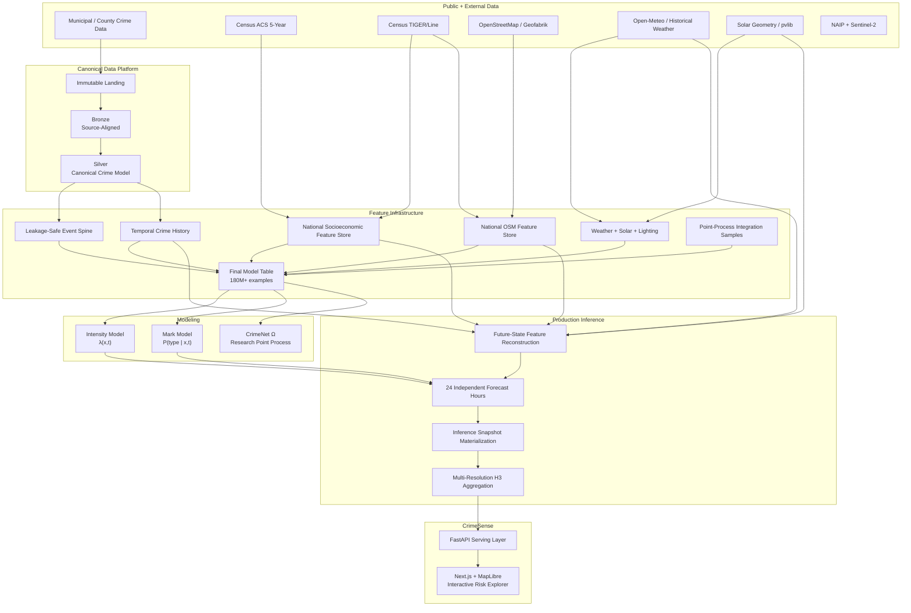

# CrimeNet

[](https://github.com/arcode35/crimenet/actions/workflows/ci.yml)


> **Live product:** [https://crimesense.ai](https://crimesense.ai)

**CrimeSense** is the interactive forecasting product.  
**CrimeNet** is the data, feature, machine-learning, and inference system that powers it.

CrimeNet turns more than a decade of heterogeneous public-safety data into a rolling **24-hour geospatial risk surface**. The system standardizes incompatible municipal crime records, joins them against national socioeconomic and OpenStreetMap feature stores, reconstructs environmental state for future timestamps, runs production inference, aggregates predictions across multiple H3 resolutions, and serves the resulting surface through CrimeSense.

The project is deliberately **data-first and modeling-second**: the core engineering problem is building a temporally correct, spatially consistent feature and inference system that can support ML reliably from historical training through live serving.

---

## At a Glance

| Metric                                                      |                               Current scale |
| ----------------------------------------------------------- | ------------------------------------------: |
| Production crime sources                                    |                                      **15** |
| Historical coverage                                         |                                **12 years** |
| Audited crime events                                        |                                   **16.7M** |
| Modeled crime subtypes                                      |                                      **87** |
| Final model examples                                        |                                   **180M+** |
| National H3 resolution-9 feature cells                      |                                  **25.56M** |
| U.S. state/DC partitions in national feature infrastructure |                                      **51** |
| Census socioeconomic match rate                             |                                  **99.83%** |
| Production features per model                               |                                      **38** |
| Forecast horizon                                            |                                **24 hours** |
| Forecast execution                                          | **24 independently inferred hourly states** |
| Train horizon                                               |                               **2014–2023** |
| Validation horizon                                          |                                    **2024** |
| Test horizon                                                | **2025 onward, bounded by source coverage** |
| Large feature-assembly workloads                            |           **billions of intermediate rows** |

### Current production geographies

- Atlanta
- Baltimore
- Chandler, AZ
- Chicago
- Dallas
- Denver
- Fort Worth
- Los Angeles County Sheriff
- Marin County Sheriff, CA
- Montgomery County, MD
- New York City
- San Francisco
- Seattle
- Sonoma County Sheriff, CA
- Washington, DC

Additional source adapters exist for other jurisdictions, but the current audited production forecasting footprint is the 15-source set above.

---

# System Architecture



The same canonical feature definitions are used from historical training through forecast-time inference. This is a core design constraint: **training-serving consistency is enforced by the data system rather than recreated ad hoc inside the API.**

---

# CrimeSense

[**CrimeSense**](https://crimesense.ai) is the interactive product layer built on CrimeNet.

The current interface exposes the output of the end-to-end forecasting pipeline rather than querying raw model objects directly.

It supports:

- navigation across the multi-city geospatial risk surface
- movement through the next **24 forecast hours**
- multiple spatial resolutions for overview and local inspection
- per-cell predicted crime intensity
- conditional distributions across **87 crime subtypes**
- production inference snapshots generated from the same feature contract used in training

The UI is intentionally the final layer of the architecture. The larger project is the infrastructure required to generate the surface correctly and reproducibly.

---

# Data Platform

## Immutable landing

Raw municipal files and external source artifacts are preserved before transformation to support:

- deterministic replay
- source-level auditing
- historical backfills
- schema debugging
- recovery from failed transformations
- reprocessing without repeatedly downloading upstream data

Large datasets and generated model artifacts live in object storage rather than Git.

## Bronze: source-aligned ingestion

Each source enters through an explicit adapter. Source-specific parsing is isolated at the ingestion boundary so incompatible municipal schemas do not leak into downstream modeling code.

The ingestion layer handles:

- CSV
- Parquet
- GeoJSON
- multi-file exports
- malformed or ragged CSVs
- historical schema changes
- source-specific timestamp and identifier conventions

## Silver: canonical crime model

Silver standardizes heterogeneous source records into one common offense representation.

The current audited production footprint contains:

- **16.7M audited crime events**
- **15 production sources**
- **87 canonical crime subtypes**

Normalization handles differences in:

- identifiers
- timestamps
- coordinates
- addresses
- offense descriptions and codes
- null encodings
- duplicate behavior
- historical source-schema changes

The result is a single crime-event contract that can be consumed by downstream spatial indexing, feature generation, training, evaluation, and inference.

---

# National Feature Infrastructure

CrimeNet uses national-scale contextual feature stores so each modeled location is represented through the same feature contract regardless of city.

## National socioeconomic feature store

The socioeconomic store is derived from U.S. Census / ACS data and materialized at H3 resolution.

Current national coverage:

- **25,563,443 unique H3 resolution-9 cells**
- **all 50 states plus Washington, DC**
- **99.83% Census socioeconomic match coverage**

Features include:

- population
- median age
- median household income
- poverty rate
- unemployment rate
- vacancy rate
- renter occupancy
- household vehicle availability

Historical observations use Census vintages that were actually available at the prediction timestamp.

## National OpenStreetMap feature store

OpenStreetMap / Geofabrik data is transformed into reusable H3-aggregated representations of the built environment.

Features include:

- total road-length density
- major-road density
- residential-road density
- service-road density
- intersection density
- dead-end density
- building density
- POI density
- nightlife density
- food density
- retail density
- transit density
- road-class ratios
- one-way-road ratio
- POI-category entropy
- land-use entropy
- commercial/residential mix

OSM snapshots are version-aware so historical examples can be joined against spatial context consistent with information availability.

## Census geography

TIGER/Line boundaries connect locations and H3 cells to historical Census geography.

Boundary vintage and release timing are part of the feature contract rather than silently applying current geography to historical rows.

---

# Point-in-Time Correctness

Leakage prevention is enforced in the data platform, not left to individual model-training scripts.

CrimeNet tracks feature metadata such as:

```text
feature_available_at
feature_version_id
osm_snapshot_date
osm_available_at
acs_vintage
acs_release_date
tiger_line_year
tiger_release_date
```

A feature is eligible only if it was available at or before the relevant prediction timestamp.

Conceptually, every historical join has to answer:

> **What could the system legitimately have known about this place at this time?**

The same rule is applied to:

- Census features
- OSM features
- environmental features
- temporal crime-history features
- train/validation/test assignment
- point-process integration support
- model evaluation

---

# Environmental and Temporal Features

## Weather

Historical weather features are derived from Open-Meteo-compatible sources and spatially deduplicated through H3.

Features include:

- temperature
- humidity
- precipitation
- wind
- cloud cover
- related atmospheric context

Missing weather coverage is represented as nullable feature state rather than silently dropping otherwise valid crime rows.

## Solar geometry and lighting

CrimeNet uses `pvlib`-derived solar calculations to represent the physical lighting state of a location and timestamp.

Features include:

- solar elevation
- solar zenith
- solar azimuth
- daylight state
- lighting condition

This gives the model a physically grounded representation of lighting rather than relying on clock time alone.

## Temporal crime history

The model table also includes local historical crime context over multiple lookback windows.

These features are computed using only events observable before the prediction timestamp.

---

# Event Spine, Integration Sampling, and Final Model Table

CrimeNet represents crime as a spatiotemporal event-intensity problem rather than only as ordinary row-wise classification.

## Event spine

Observed offenses are converted into a leakage-safe event spine containing:

- canonical spatial keys
- timestamps
- source identity
- crime labels
- split assignment
- point-in-time feature eligibility

Historical events remain part of the event spine even if optional enrichment fields are unavailable.

## Monte Carlo integration samples

Point-process likelihoods require exposure over non-event space-time.

CrimeNet therefore constructs source-aware Monte Carlo integration samples over authoritative reporting domains using:

- **H3 cell × continuous time** as the integration measure
- source-specific temporal coverage
- outcome-independent sampling support
- deterministic source-level random seeds
- integration weights
- strict source-domain contracts

Sampling never extends a source outside its declared temporal support.

## Temporal splits

The split contract is centralized:

```text
Train       2014–2023
Validation  2024
Test        2025 onward within declared source coverage
```

The test horizon remained sealed during model development.

## Final model table

Observed event rows and integration rows are combined with:

- national socioeconomic features
- national OSM features
- weather
- solar and lighting state
- calendar context
- temporal crime-history features
- event/integration weights
- canonical crime labels
- source-aware split assignment

The current full-scale pipeline produces **180M+ leakage-safe spatial-temporal examples**.

Publication checks include:

- structural null validation
- split correctness
- future-feature leakage
- integration-weight validity
- feature coverage
- weather coverage
- source/split/row-type counts
- immutable snapshot identity

---

# Machine Learning

CrimeNet currently separates forecasting into two production modeling problems.

## 1. Intensity model — λ(x,t)

The intensity model estimates expected event activity for a location and hour.

The production modeling workflow includes:

- Poisson-style intensity modeling
- GPU-accelerated training
- Optuna hyperparameter optimization
- temporal validation
- geographic validation
- calibration analysis
- feature-importance analysis
- reproducible model artifacts and training metadata

## 2. Mark model — P(type | x,t)

The mark model estimates the conditional probability distribution over **87 crime subtypes** for a location and timestamp.

Separating intensity from event type allows the system to model:

1. **how much activity is expected**, and
2. **what kind of activity is expected**

as distinct statistical problems.

## CrimeNet Ω

**CrimeNet Omega** is the research point-process model built on the same data and feature infrastructure.

The implemented research architecture supports:

- city embeddings
- offense-family / subtype embeddings
- lighting-state embeddings
- continuous numerical covariates
- event exposure
- marked-event likelihoods
- temporal intensity modeling

Research directions include:

- covariate-conditioned neural Hawkes processes
- hierarchical crime-taxonomy structure
- continuous-time spatial context
- graph-based neighborhood interaction
- explicit observation / reporting models

Omega is evaluated against production tree-based and historical baselines rather than assumed to be superior.

---

# Production Inference

The serving system does not simply send a static training row through a model.

For every forecast timestamp, CrimeNet reconstructs the feature state needed to answer:

> **What will this location look like at this future hour?**

The inference pipeline resolves:

- static socioeconomic context
- built-environment features
- calendar state
- future-hour weather context
- solar geometry
- lighting state
- recent crime-history features

It then runs **24 independently inferred forecast hours**.

Each hour is materialized into an inference snapshot and passed through spatial aggregation layers before being exposed through the API.

This produces a rolling H3 risk surface that can be queried efficiently at multiple map zoom levels.

---

# Multi-Resolution Geospatial Serving

Rendering a large H3 surface directly at full resolution is unnecessarily expensive.

CrimeNet therefore materializes multiple levels of spatial detail for serving.

The serving layer is responsible for:

- H3-based forecast storage
- viewport-aware retrieval
- aggregation across spatial resolutions
- efficient map payloads
- individual-cell inspection
- forecast-hour selection

The result is a map that can move between regional overview and local inspection without requiring the browser to load the entire high-resolution surface.

---

# Distributed Compute

CrimeNet separates durable data from disposable compute.

## CPU / memory-heavy workloads

Used for:

- source normalization
- large joins
- H3 feature construction
- national feature-store generation
- historical backfills
- Parquet materialization
- spatial preprocessing
- final-model-table assembly

## GPU workloads

Used for:

- XGBoost training and HPO
- neural point-process training
- large inference workloads
- aerial / satellite representation learning

Large experiments have run on cloud machines with **up to 8× RTX 5090-class GPUs** and hundreds of gigabytes of host memory.

Training and inference workers are disposable. Dataset snapshots, manifests, feature versions, and model artifacts are durable.

---

# Imagery Pipeline

CrimeNet also contains an imagery feature pipeline using:

- **NAIP** high-resolution aerial imagery
- **Sentinel-2 L2A** multispectral satellite imagery

The pipeline supports:

- scene discovery
- spatial deduplication
- retrieval
- preprocessing
- embedding generation
- versioned feature storage

Image-derived representations are currently an experimental enrichment path rather than a required dependency of the production CrimeSense forecast.

---

# Orchestration

The data platform is orchestrated with **Dagster**.

Assets cover:

- source landing
- Bronze ingestion
- Silver normalization
- event-spine construction
- national socioeconomic features
- national OSM features
- environmental features
- temporal-history features
- integration sampling
- final-model-table construction
- model training
- evaluation

This provides:

- dependency-aware execution
- structured logging
- materialization metadata
- failure isolation
- backfills
- reproducible re-runs

Production serving is kept operationally separate from offline training orchestration so forecast generation and the web product are not coupled to a Dagster development process.

---

# Data Quality and Reproducibility

CrimeNet fails closed when core contracts are violated.

Checks include:

- required-field validation
- timestamp parsing
- coordinate bounds
- source-key deduplication
- canonical-taxonomy coverage
- spatial-match validation
- feature-key uniqueness
- point-in-time eligibility
- join-cardinality checks
- temporal-support validation
- train/validation/test leakage controls
- integration-weight validation
- feature-coverage monitoring
- immutable snapshot identity and lineage

Model lineage can be traced conceptually through:

```text
model artifact
    ↓
final-model-table snapshot
    ↓
event + integration snapshots
    ↓
feature versions
    ↓
Gold / Silver records
    ↓
Bronze source data
    ↓
original landing object
```

---

# Technology Stack

## Data engineering

- Python
- Dagster
- Polars
- PyArrow
- Apache Spark / PySpark
- Delta Lake / delta-rs
- H3
- DuckDB
- object storage

## Geospatial and external data

- OpenStreetMap / Geofabrik
- U.S. Census ACS
- Census TIGER/Line
- Open-Meteo-compatible weather data
- `pvlib`
- NAIP
- Sentinel-2 L2A

## Machine learning

- XGBoost
- PyTorch
- Optuna
- CUDA / GPU training
- temporal validation
- geographic validation
- marked temporal point-process research

## Serving and product

- FastAPI
- Next.js / React
- MapLibre
- H3 multi-resolution spatial serving
- production inference snapshots

## Engineering

- `uv`
- `pytest`
- GitHub Actions
- Python packaging
- configuration-driven pipelines
- immutable dataset / model artifacts

---

# Repository Layout

```text
crimenet/
├── src/
│   ├── crimenet_data/
│   │   ├── assets/
│   │   │   ├── crime/               # Source ingestion + canonicalization
│   │   │   ├── event_spine/         # Leakage-safe event construction
│   │   │   ├── integration/         # Point-process integration sampling
│   │   │   ├── environmental/       # Weather + solar enrichment
│   │   │   └── final_model_table/   # Canonical model dataset
│   │   ├── national_h3_audit/       # National feature-store audits
│   │   ├── resources/               # Storage + path contracts
│   │   └── definitions.py           # Dagster definitions
│   │
│   └── machine_learning/
│       ├── data/                     # Model-table + geographic CV utilities
│       ├── experiments/              # HPO + evaluation orchestration
│       └── models/
│           ├── xgboost/
│           └── crimenet_omega/
│
├── tests/
├── artifacts/
├── pyproject.toml
└── README.md
```

Large datasets, model artifacts, source downloads, inference snapshots, and experiment outputs are intentionally excluded from Git.

---

# Local Development

## Install

```bash
uv sync
```

## Start Dagster

```bash
uv run dagster dev -m crimenet_data.definitions
```

## Run tests

```bash
uv run pytest
```

Environment-specific storage and service credentials should be provided through environment variables and must not be committed.

---

# Current Status

## Completed

- [x] 15-source audited production crime footprint
- [x] Canonical 87-subtype crime taxonomy
- [x] 12-year historical modeling horizon
- [x] National H3-r9 socioeconomic feature store
- [x] National OpenStreetMap feature store
- [x] National feature-store structural audits
- [x] TIGER/Line geographic mapping
- [x] Historical weather enrichment
- [x] Solar and lighting enrichment
- [x] Leakage-safe feature-availability logic
- [x] Event-spine construction
- [x] Source-specific temporal-support contracts
- [x] Monte Carlo integration sampling
- [x] 180M+ example final model table
- [x] Chronological train/validation/test split contract
- [x] Production intensity modeling pipeline
- [x] Conditional 87-subtype mark modeling pipeline
- [x] Optuna hyperparameter-optimization infrastructure
- [x] Geographic and temporal evaluation infrastructure
- [x] Training-serving feature contract
- [x] Future-state feature reconstruction
- [x] Rolling 24-hour inference
- [x] Production inference snapshot materialization
- [x] Multi-resolution H3 serving layer
- [x] FastAPI inference service
- [x] Interactive CrimeSense geospatial explorer
- [x] Public CrimeSense deployment at [crimesense.ai](https://crimesense.ai)
- [x] CrimeNet Omega initial implementation
- [x] NAIP and Sentinel-2 imagery pipelines
- [x] Dagster orchestration
- [x] GitHub Actions CI

## In progress

- [ ] Full-scale CrimeNet Omega experimentation
- [ ] Hierarchical marked-event modeling
- [ ] Explicit reporting / observation model
- [ ] Larger-scale imagery integration into the production feature contract
- [ ] Additional source promotion beyond the current 15-source production footprint
- [ ] Production monitoring and forecast-quality observability

## Planned

- [ ] Streaming source ingestion
- [ ] Kafka / Flink event pipeline
- [ ] Automated drift detection
- [ ] Scheduled retraining
- [ ] Low-latency online feature retrieval where justified
- [ ] Expansion of the production forecast footprint beyond the current 15 geographies

---

# Responsible Use

CrimeNet models **observed crime and reporting patterns across geographic areas and time windows**.

It does **not** model an individual's propensity to commit a crime and is not designed to:

- identify likely offenders
- predict person-level criminal behavior
- support person-level surveillance
- make automated policing decisions
- determine guilt, dangerousness, or intent
- replace public-policy or domain-expert review

Observed crime records can reflect:

- reporting behavior
- police deployment
- enforcement intensity
- data-collection practices
- municipal policy
- historical bias

A technically calibrated prediction of recorded crime is therefore **not necessarily an unbiased estimate of all crime that occurred or will occur**.

CrimeSense should be interpreted as a geospatial forecasting and systems-engineering project, not as a person-level decision system.

---

# Background

CrimeNet grew out of **AcciNet**, an earlier statewide geospatial crash-risk platform.

CrimeNet extends that engineering approach into a substantially larger system with:

- heterogeneous public-data ingestion
- national feature infrastructure
- point-in-time feature correctness
- source-specific temporal support
- hundreds of millions of model examples
- distributed GPU experimentation
- production future-state inference
- multi-resolution geospatial serving
- continuous-time event-modeling research
- a live interactive product

The project is intentionally built as an engineering and ML system rather than a one-off modeling notebook.

---

# Live Demo

**CrimeSense:** [https://crimesense.ai](https://crimesense.ai)

---

# License

Copyright 2026 Aldrin Roshan.

Licensed under the [Apache License 2.0](LICENSE).
