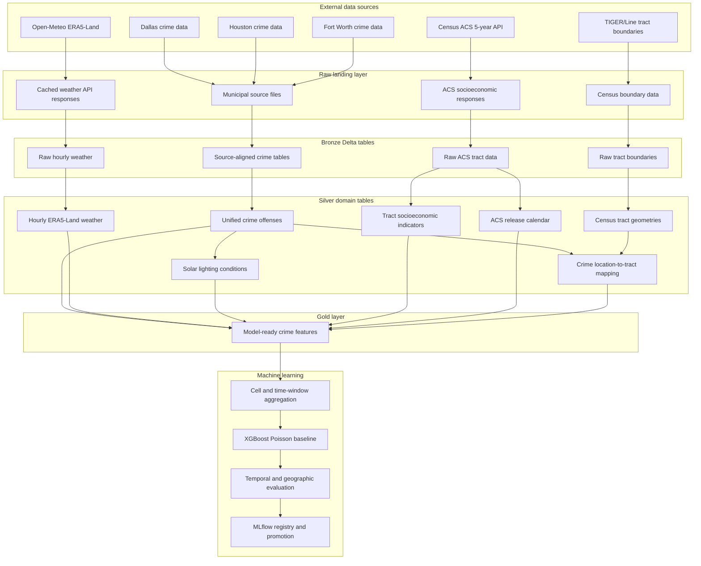
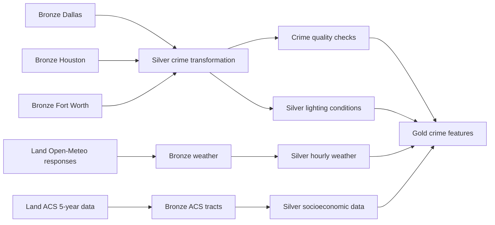

# CrimeNet

[](https://github.com/arcode35/crimenet/actions/workflows/ci.yml)


**CrimeNet is an end-to-end geospatial data and machine learning platform for predicting aggregate crime counts across geographic areas and time windows. It is a scalable, production-oriented successor to AcciNet, an award-winning crash analytics platform that I architected and developed.**

The project ingests heterogeneous municipal crime data from Dallas, Houston, and Fort Worth, standardizes incompatible source schemas, enriches records with 12 years of hourly weather, solar-lighting conditions, Census tract boundaries, and socioeconomic indicators, and materializes a governed Gold feature table for crime forecasting.

The complete data platform is implemented on Databricks using PySpark, Delta Lake, Unity Catalog, Databricks Asset Bundles, and Azure Data Lake Storage Gen2.

The next phase uses an **XGBoost Poisson regression model** as the initial count-prediction baseline.

---

## Project Status

### Completed

- Multi-city raw-data acquisition
- Bronze ingestion for Dallas, Houston, and Fort Worth
- Source-specific schema normalization
- Unified Silver crime-offense model
- Timestamp, identifier, coordinate, and offense normalization
- Data-quality validation and quarantine workflows
- H3-based spatial indexing
- Twelve years of hourly ERA5-Land weather ingestion
- Incremental weather-response caching
- Solar-position and lighting-condition computation
- Census ACS 5-year socioeconomic ingestion
- TIGER/Line Census tract boundary processing
- Leakage-safe ACS vintage selection
- Point-in-polygon crime-to-tract mapping
- Gold feature-table materialization
- Feature-join coverage validation
- Row-cardinality validation
- Databricks Asset Bundle orchestration
- Automated tests and GitHub Actions CI

### In progress

- Geographic and temporal aggregation targets
- XGBoost Poisson baseline training
- Temporal train, validation, and test splitting
- Baseline evaluation and error analysis
- MLflow experiment tracking

### Planned

- Hyperparameter optimization
- Additional count-model baselines
- Probability and count calibration analysis
- Geographic stability evaluation
- Feature-attribution analysis
- Model registration and controlled promotion
- Data- and prediction-drift monitoring
- Automated retraining
- Batch inference
- Prediction-serving and visualization layers

---

## Why CrimeNet

Municipal crime datasets are not delivered as a clean, unified analytical product.

Each city publishes data with different:

- File formats
- Column names
- Identifier conventions
- Timestamp formats
- Coordinate systems
- Offense taxonomies
- Missing-value behavior
- Historical coverage
- Update patterns

CrimeNet solves the data-engineering problem before approaching the modeling problem.

Instead of training directly on one cleaned CSV, the project builds a reproducible lakehouse that can:

1. Preserve raw inputs.
2. Standardize heterogeneous sources.
3. Validate and quarantine malformed records.
4. Enrich records with time-correct environmental and socioeconomic data.
5. Incrementally materialize reusable feature tables.
6. Produce stable inputs for model training and evaluation.

---

## System Architecture



---

## Databricks Workflow

The pipeline is deployed as a Databricks Asset Bundle and executed as a dependency-aware Databricks job.



Independent branches execute concurrently where their dependencies permit it.

Job tasks are implemented as Python wheel entry points rather than notebook-only workflows, allowing the pipeline to be packaged, tested, versioned, and deployed through CI/CD.

---

## Data Sources

| Domain        | Source                          |                       Coverage | Purpose                                         |
| ------------- | ------------------------------- | -----------------------------: | ----------------------------------------------- |
| Crime         | Dallas municipal crime data     | Historical and current records | Crime incidents and offenses                    |
| Crime         | Houston municipal crime data    | Historical and current records | Crime incidents and offenses                    |
| Crime         | Fort Worth municipal crime data | Historical and current records | Crime incidents and offenses                    |
| Weather       | Open-Meteo Archive API          | Approximately 12 years, hourly | ERA5-Land environmental conditions              |
| Socioeconomic | U.S. Census Bureau ACS 5-year   |             2012–2024 vintages | Tract-level demographic and economic indicators |
| Boundaries    | Census TIGER/Line               |     Multiple boundary vintages | Point-in-polygon tract assignment               |
| Lighting      | `pvlib` calculations            |         Hourly crime locations | Solar geometry and ambient-light classification |

---

## Medallion Architecture

### Raw landing

The raw landing layer preserves municipal files and external API responses before transformation.

This supports:

- Deterministic replay
- Recovery from downstream failures
- Source-level auditing
- Debugging of malformed records
- API-response reuse
- Reduced external request volume

Weather responses are cached using deterministic request identifiers so repeated executions do not unnecessarily call the external API.

### Bronze

Bronze tables preserve source-aligned records with ingestion metadata.

Typical operational fields include:

- Source city
- Source file
- Source record identifier
- Ingestion timestamp
- File path
- Source row hash
- Rescued or malformed input data

Bronze processing intentionally avoids forcing all cities into one schema.

### Silver

Silver transformations convert source-specific datasets into reusable domain models.

The Silver layer includes:

- Unified crime offenses
- Hourly weather observations
- Solar-lighting conditions
- ACS socioeconomic indicators
- ACS release-calendar metadata
- Census tract geometries
- Crime-location-to-tract mappings
- Data-quality quarantine tables

### Gold

The Gold layer combines crime records with environmental, spatial, and socioeconomic features.

Each output record can contain:

- Stable crime-offense identifier
- Standardized city and offense attributes
- Event timestamp and calendar features
- H3 query cell
- Hourly weather
- Solar elevation and azimuth
- Daylight status
- Lighting category
- Census tract identifier
- Eligible ACS vintage
- Population and socioeconomic indicators
- Feature-match indicators

Gold materialization verifies that feature joins do not accidentally duplicate or remove source crime records.

---

## Source Standardization

Each city is transformed independently before being projected into the unified Silver schema.

The standardization layer resolves differences in:

- Incident and offense identifiers
- Date and time columns
- Address fields
- Latitude and longitude columns
- Crime descriptions and codes
- Null encodings
- Duplicate records
- Source metadata
- Historical anomalies

A shared schema allows downstream enrichment and model preparation to operate without embedding city-specific conditions throughout the rest of the pipeline.

---

## Geospatial Processing

CrimeNet uses both H3 indexes and Census tract geometries.

### H3 query cells

H3 cells provide reusable spatial keys for environmental enrichment.

They are used to:

- Deduplicate weather requests
- Deduplicate solar calculations
- Reduce the number of API calls
- Reuse observations across nearby crime records
- Support future cell-based prediction targets
- Produce spatially consistent model inputs

Weather and lighting are calculated at the center of the associated H3 query cell.

This avoids performing the same calculation independently for every crime coordinate while retaining sufficient geographic precision for regional environmental features.

### Census tract mapping

Crime coordinates are mapped to Census tracts using native Databricks spatial functions.

The mapping process:

1. Creates WGS84 point geometries from longitude and latitude.
2. Matches each point against the correct TIGER/Line boundary vintage.
3. Uses `ST_Contains` for standard point-in-polygon matching.
4. Uses `ST_Covers` as a fallback for points located on tract boundaries.
5. Rejects ambiguous fallback matches.
6. Stores reusable location-to-tract mappings incrementally.

The location-mapping key is:

```text
tiger_line_year + latitude + longitude
```

Previously processed coordinate and boundary-vintage combinations do not need to be spatially recomputed.

---

## Weather Enrichment

CrimeNet ingests approximately 12 years of hourly ERA5-Land weather through the Open-Meteo Archive API.

The weather workflow includes:

- Extraction of unique H3 cells and year combinations
- Deterministic request planning
- SHA-based request identifiers
- Raw JSON response caching
- Retry and recovery support
- Bronze ingestion
- Hourly Silver transformation
- Provider and model metadata
- Duplicate-key validation
- Incremental processing

Weather is joined to crime records using:

```text
crime.weather_query_cell_id = weather.weather_query_cell_id
crime.weather_timestamp     = weather.weather_timestamp
```

The weather lookup is validated to contain no duplicate rows for:

```text
weather_query_cell_id + weather_timestamp
```

---

## Solar and Lighting Enrichment

Solar conditions are calculated with `pvlib` for every unique H3 query-cell center and UTC hour represented in the crime data.

Generated features include:

- `solar_elevation_deg`
- `apparent_solar_elevation_deg`
- `solar_zenith_deg`
- `solar_azimuth_deg`
- `lighting_condition`
- `is_daylight`
- `pvlib_version`
- `lighting_definition_version`
- `computed_at`

Lighting records are keyed by:

```text
weather_query_cell_id + solar_timestamp
```

They are joined to crime records using:

```text
crime.weather_query_cell_id = lighting.weather_query_cell_id
crime.weather_timestamp     = lighting.solar_timestamp
```

The lighting table is incrementally materialized so solar calculations are performed only for previously unseen location-hour keys.

All Spark timestamp processing is performed in UTC to maintain consistent joins between crime, weather, and solar data.

---

## Socioeconomic Enrichment

CrimeNet ingests tract-level ACS 5-year estimates from the U.S. Census Bureau.

Example features include:

- Population
- Population margin of error
- Median age
- Median household income
- Poverty rate
- Unemployment rate
- Vacancy rate
- Renter-occupied housing rate
- No-vehicle household rate

Each crime record is first mapped to a Census tract and then joined to the appropriate ACS vintage.

---

## Leakage-Safe ACS Selection

A common modeling error is attaching the newest available Census data to every historical observation.

CrimeNet avoids this by selecting ACS vintages according to their release dates.

For each ACS release:

```text
eligible_start_date = acs_release_date + 1 day
```

A crime can use an ACS vintage only when that release was publicly available at the time of the event.

This ensures that historical training records are not enriched with socioeconomic information published in the future.

The socioeconomic join uses:

```text
crime.tract_geoid          = socioeconomic.geoid
crime.selected_acs_vintage = socioeconomic.acs_vintage
```

---

## Data Quality and Validation

Quality enforcement is integrated into the pipeline rather than applied as a final cleanup step.

Implemented controls include:

- Required-field validation
- Timestamp parsing checks
- Date-range validation
- Latitude and longitude validation
- Source-key deduplication
- Malformed-record quarantine
- Geometry-null validation
- Spatial-reference validation
- Boundary-vintage coverage checks
- Lookup-key uniqueness checks
- Incremental-key deduplication
- Feature-match coverage metrics
- Final row-cardinality validation

Invalid records are quarantined rather than silently discarded.

Feature joins use left joins so missing enrichment data does not remove crime records.

Boolean indicators distinguish between:

- No matching feature row
- A matching row containing a nullable feature value

Examples include:

- `weather_match_found`
- `lighting_match_found`
- `socioeconomic_match_found`

---

## Cardinality Guarantees

Each lookup table is checked for duplicate join keys before enrichment.

After materialization, CrimeNet compares the Gold row count with the source crime row count.

The pipeline fails when:

```text
source crime rows != final Gold feature rows
```

This catches accidental many-to-many joins and silent row loss before the data reaches model training.

---

## Machine Learning Baseline

CrimeNet will predict crime counts for geographic cells and fixed time windows.

The first model will be an **XGBoost Poisson regression baseline**.

A Poisson objective is appropriate as an initial benchmark because the target is a non-negative event count rather than a continuous unrestricted value or person-level classification label.

The baseline workflow will include:

1. Aggregate crime events by H3 cell and prediction window.
2. Construct historical and environmental features.
3. Split data chronologically.
4. Train an XGBoost model using a count objective.
5. Compare against naive historical baselines.
6. Evaluate temporal and geographic stability.
7. Log parameters, metrics, and artifacts with MLflow.

Potential evaluation metrics include:

- Poisson deviance
- Mean absolute error
- Root mean squared error
- Mean absolute scaled error
- Rank correlation
- Calibration by predicted-risk band
- Geographic error distribution

The Poisson model is a baseline, not an assumption that real crime counts perfectly follow a Poisson distribution. Overdispersion, excess zeros, temporal dependence, and spatial dependence will be evaluated empirically.

---

## Leakage-Aware Modeling

The modeling workflow is designed around chronological evaluation.

Controls include:

- Temporal train, validation, and test partitions
- No random row-level splitting across time
- Historical weather matched only to the event hour
- ACS data restricted by release availability
- Feature windows ending before the prediction period
- Fit-only-on-training preprocessing
- Historical baseline comparison
- Geographic stability analysis

Randomly dividing crime observations would allow nearby time periods and repeated spatial locations to appear across all data partitions, producing an unrealistically optimistic evaluation.

---

## Technology Stack

### Data platform

- Databricks
- Apache Spark
- PySpark
- Delta Lake
- Unity Catalog
- Databricks Asset Bundles
- Azure Data Lake Storage Gen2
- Databricks serverless jobs

### Data acquisition and enrichment

- Open-Meteo Archive API
- ERA5-Land
- U.S. Census Bureau ACS API
- Census TIGER/Line boundaries
- `pvlib`
- H3

### Machine learning

- XGBoost
- Poisson count objective
- MLflow experiment tracking
- MLflow Model Registry
- Temporal validation
- Geographic stability evaluation

### Engineering

- Python 3.12
- SQL
- `uv`
- `pytest`
- GitHub Actions
- Structured logging
- Python wheel packaging
- Environment-specific deployment targets

---

## Repository Structure

```text
crimenet/
├── docs/                       # Architecture, contracts, quality, and operations
├── notebooks/                  # Exploration and model-development notebooks
├── resources/                  # Databricks Asset Bundle job definitions
├── scripts/                    # Local validation and deployment commands
├── src/crimenet/
│   ├── bronze/                 # Source-aligned Bronze ingestion
│   ├── config/                 # Environment and resource configuration
│   ├── contracts/              # Dataset schemas and data contracts
│   ├── gold/                   # Gold feature engineering
│   ├── ingestion/              # Source readers and landing utilities
│   ├── jobs/                   # Python wheel job entry points
│   ├── observability/          # Structured logging and operational metrics
│   ├── quality/                # Validation and quarantine rules
│   ├── silver/                 # Standardized domain transformations
│   ├── spatial/                # H3 and spatial-processing utilities
│   ├── transforms/             # Source-specific normalization
│   ├── utils/                  # Shared Python and Spark utilities
│   └── weather/                # Weather planning, retrieval, and caching
├── targets/                    # Development and production configuration
└── tests/                      # Unit, integration, and fixture data
```

---

## Running the Project

### Prerequisites

- Python 3.12
- `uv`
- Databricks CLI
- A Databricks workspace with Unity Catalog enabled
- Access to the configured ADLS Gen2 storage account

### Install dependencies

```bash
uv sync
```

### Authenticate with Databricks

```bash
databricks auth login
```

### Validate the development bundle

```bash
databricks bundle validate --target dev
```

### Deploy the project

```bash
databricks bundle deploy --target dev
```

### Execute the end-to-end pipeline

```bash
databricks bundle run --target dev crime_pipeline
```

---

## Local Development

Run the test suite:

```bash
uv run pytest
```

Run project validation:

```bash
./scripts/check.sh
```

Build the Python wheel:

```bash
uv build
```

Validate a production deployment:

```bash
databricks bundle validate --target prod
```

---

## Engineering Principles

CrimeNet is built around several design principles:

### Preserve before transforming

Raw files and API responses remain available for replay, auditing, and debugging.

### Standardize at domain boundaries

City-specific logic is isolated before records enter the shared Silver model.

### Compute expensive features once

Weather, lighting, and spatial mappings are materialized using reusable keys and processed incrementally.

### Fail on ambiguous joins

Duplicate lookup keys and changed row cardinality cause pipeline failures rather than silently corrupting features.

### Treat leakage prevention as data engineering

Release dates, timestamps, and feature eligibility are enforced before model training.

### Separate implemented work from planned work

The completed lakehouse and feature pipeline are production-style implementations. Model training, registry, monitoring, and serving are tracked separately until implemented.

---

## Responsible Use

CrimeNet predicts aggregate event counts across geographic areas and time windows.

It is not designed to:

- Predict whether a specific person will commit a crime
- Identify likely offenders
- Support person-level surveillance
- Make automated policing decisions
- Replace human review or public-policy analysis

Crime data reflects reporting behavior, enforcement patterns, administrative practices, missing records, and historical bias. Model outputs must therefore be interpreted as estimates derived from recorded incidents, not objective measurements of community behavior or individual risk.

---

## Documentation

Additional documentation is available under [`docs/`](docs/):

- [`architecture.md`](docs/architecture.md)
- [`data_contracts.md`](docs/data_contracts.md)
- [`data_quality.md`](docs/data_quality.md)
- [`operations_runbook.md`](docs/operations_runbook.md)

---

## Roadmap

- [x] Multi-city crime ingestion
- [x] Source-specific Bronze tables
- [x] Unified Silver crime schema
- [x] Data-quality and quarantine workflows
- [x] H3 spatial indexing
- [x] Historical hourly weather ingestion
- [x] Weather caching and recovery
- [x] Solar-lighting computation
- [x] ACS socioeconomic ingestion
- [x] Census tract boundary processing
- [x] Crime-to-tract spatial mapping
- [x] Leakage-safe ACS feature selection
- [x] Gold feature materialization
- [x] Join coverage and cardinality validation
- [x] Databricks Asset Bundle orchestration
- [x] GitHub Actions CI
- [ ] Cell and time-window target construction
- [ ] XGBoost Poisson baseline
- [ ] Temporal baseline evaluation
- [ ] MLflow experiment tracking
- [ ] Hyperparameter optimization
- [ ] Model registration and promotion
- [ ] Drift monitoring
- [ ] Automated retraining
- [ ] Batch prediction pipeline
- [ ] Prediction API
- [ ] Interactive visualization

---

## License

License information will be added before the first public release.
